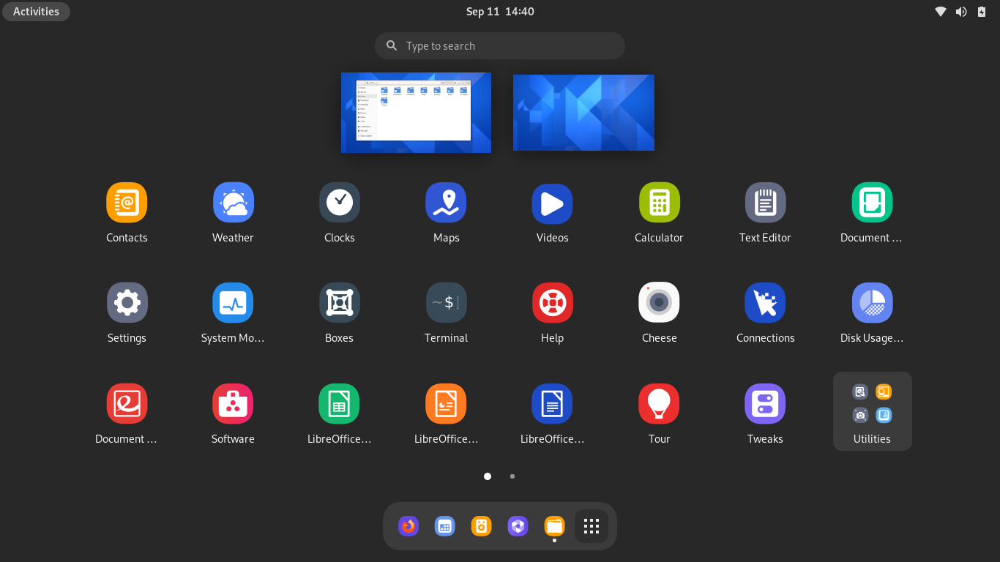

# DX Icon Theme

DX is a modern minimalist icon theme based on the [Dex KDE icon theme](https://github.com/ishovkun/Dex) and [Papirus](https://github.com/PapirusDevelopmentTeam/papirus-icon-theme) 

## :computer: Screenshots

## :open_file_folder: Installing

WIP

